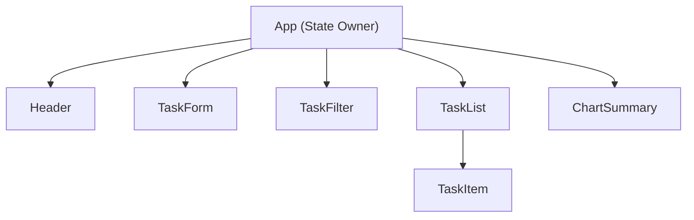

# TaskFlow - Frontend Practical Assignment

## Deliverables

### 6 & 7. Screenshots

- [Desktop View](./screenshots/desktop.png)
- [Mobile View](./screenshots/mobile.png)

### 8. Component Hierarchy Diagram

### 9. Three AI Prompts Used

**Prompt 1 (Component Planning):**
> "i feel there is a better way to the organize the code, or its ok for this case now? and do we need state.ts and coutner.ts? and view .ts?"

**Prompt 2 (Implementation Review):**
> "explain to me in big appilcations its impossible to pass the funtino more than one layer so we have state management solution like in flutter i am a flutter developer, right?"

**Prompt 3 (Debugging & Responsive Design):**
> "DID NOT WORK!! CAN YOU READ THE OFFICAL DOC FOR RESPONSIBLITY THEN COME AND SOLVE ALL THE RESPONSIBLITY PROBLEMS ON DESKTOP IPAD MOBILE CONSIDERING THE FILTER BAR IS UNDER THE SUMMARY JUST IN MOBILE VIEW"

---

### 10. Short Reflection

**What did AI help me with?**
The AI acted as a Senior Engineering Mentor. It helped me configure the initial Vite environment for React, explained the conceptual transition from Vanilla JavaScript DOM manipulation to React's declarative JSX, and helped me debug responsive CSS layout issues (such as why flex items were not taking up the full width).

**What did I have to understand and verify myself?**
I had to deeply understand the concept of "State" and how data flows in a React application. Rather than just letting the AI write code, I verified the component architecture (ensuring we didn't have one massive App component) and made sure I understood how `useState` triggers re-renders. I also took full ownership of the CSS, building a robust, responsive grid layout and adding custom SVG icons without relying on the AI to write the styling for me.

**Which AI suggestion did I reject or modify, and why?**
The AI suggested moving all the state logic (`useState`, `useEffect`, `addTask`, `deleteTask`) into a custom hook called `useTasks.ts` to separate the business logic from the UI. While this is a good pattern for large apps, I rejected this and moved the logic back into `App.tsx` because returning 9 different properties from a single hook felt like a Code Smell (violating the Single Responsibility Principle), and for an app of this size, keeping it in `App.tsx` was much simpler and easier to maintain.

**How did I decide where state should live?**
I placed the `tasks` and `filter` state at the very top level in `App.tsx`. Because `App` is the parent of the `TaskList` (which needs the tasks), the `TaskFilter` (which needs the filter), and the `ChartSummary` (which needs the counts), the state had to live in this lowest common ancestor. This allowed me to easily pass the necessary data and functions down as props to all the child components.
